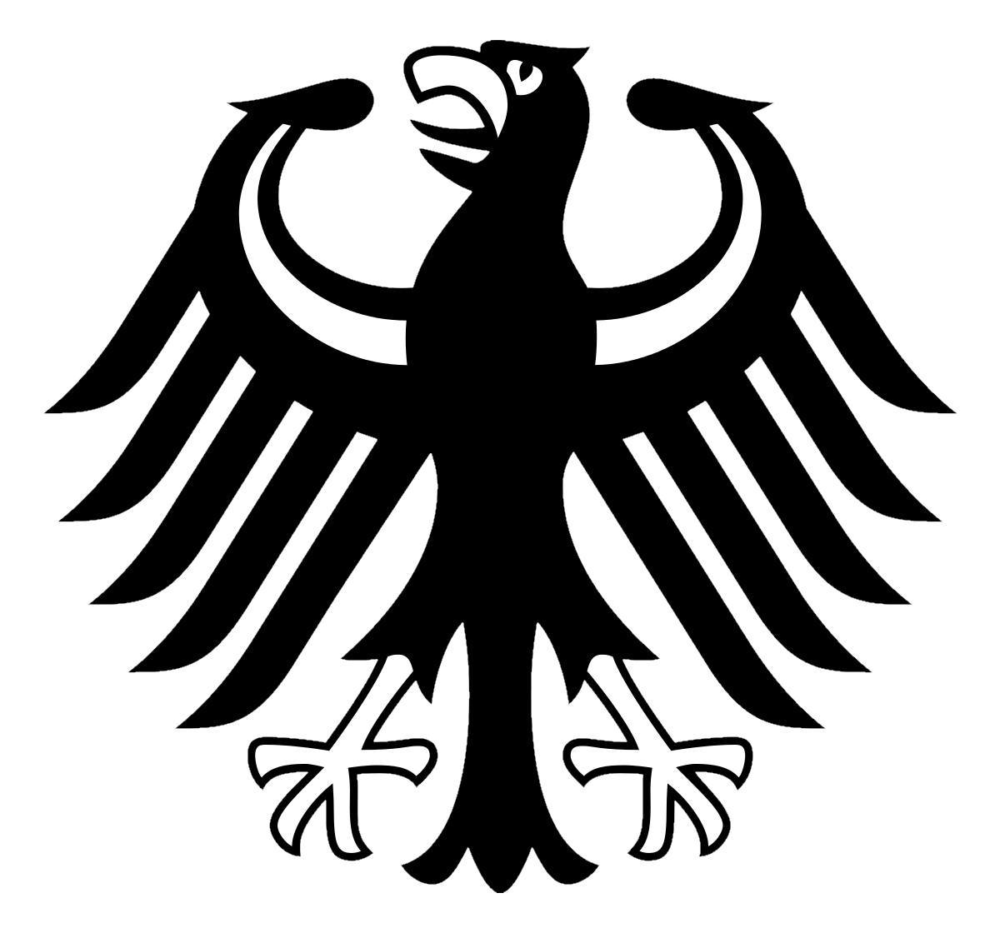

# Word Clouds

I've created a word cloud of the [Grundgesetz](https://en.wikipedia.org/wiki/Basic_Law_for_the_Federal_Republic_of_Germany) (German Basic Law), using the simplified version of the [Bundesadler](https://en.wikipedia.org/wiki/Coat_of_arms_of_Germany#Federal_Republic_of_Germany_) as the mask.

This has been created with help from the guides and examples given [here](http://amueller.github.io/word_cloud/auto_examples/index.html)

 

## Things to Do/Improve

- [x] ~~Create Basic Word Cloud~~
- [ ] Identify more stopwords to remove, such as frequently occuring functional terms, z.B. _Absatz_.
- [ ] Change default colour scheme (Overlay flag colours?)
- [ ] Reduce words to stems to remove similar entries, z.B. _bestimmt_-_bestimmen_, _Gesetz_-_Gesetze__.
- [ ] Alter the area where the words are placed. Currently words appear just in the black parts of the image.
- [ ] Try a more complicated image mask, such the full coat of arms

## Future Goals
- [ ] Attempt this project with a different language and text, z.B. Japanese and Constitution of Japan?
- [ ] UN Declaration of Human Rights in colours and form of country flags?
